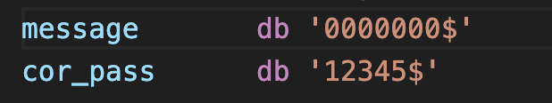

# Взлом пароля или как найти уязвимости и быть успешным

### Введение
Цель задания написать программу, которая будет содержать уязвимости (переполнение буффера ввода, неправильное хэширование и тд). Напарник, получив скомпилированный file.com, должен найти эти уязвимости, ввести неправильный пароль, который выдаст ему
```
Password received
```

### Поговорим о том, какие уязвимости я создала
Взяла руки в ноги и сделала 2 узвимости, которые представляют из себя:

#### 1. Переполнение буффера
переполнение буффера ввода, за которым лежит строка с паролем. При вводе сообщения с последующим строкой паролей возможно переполнение буфера ввода (в моем случае если ввести больше 5 символов), что приводит к потенциальной утрате правильного пароля. Это означает, что можно видоизменить память и затереть правильный пароль, обеспечив себе положительный ответ на правильность введенного пароля.

На картинке видно, что две строки лежат рядом, то есть в памяти они тоже будут лежать рядом. ТАким образом можно залезть на следующую строку и видоизменить её.




#### 2. Некорректный подсчет суммы хэша символов
некорректный подсчет суммы хэша символов. Изначально я сверяла введенный пароль и правильный пароль через посимвольное сравнение двух строк (aka функция strcmp на си, если вы понимаете о чем я). Если спользовать такое, то получится довольно защищенный пароль, ведь ничего кроме как правильного пароль мы ввести не сможем, ведь у нас четко будут сравниваться символы.

Тогда я подумала, что можно каждому символу присвоить "вес" и сравнивать посимвольно весы двух строк.

Разберемся что такое "вес" символа:
    есть функия **ReturSymbolKey**, которая возвращает значение веса символа. Используя jump, функция сравнивает символ с троки с различными буквами и цифрами.

``` c
    mov dx, '0'                     ; Загружаем значение '0' в регистр DX
    cmp al, dl                      ; Сравниваем значение в регистре AL с '0'
    jl not_digit                    ; Если значение в AL меньше '0', переходим к not_digit
```

В данном коде представлен фрагмент сравнения символа строки с '0', если символ меньше 0, то происходит прыжок на другую метку. Таким образом получаются символы 'a', 'b', которые возвращают 4.

Полная таблчика "весов" символов:
``` c
    'a', 'b'      -----> 4
    'c', 'd', 'e' -----> 5
    'f', 'g', 'h' -----> 6
    'i', 'j', 'k' -----> 7
    'l', 'm', 'n' -----> 8
    'o', 'p', 'q' -----> 9
    'r', 's', 't' -----> 8
    'u', 'v', 'w' -----> 10
    'x', 'y', 'z' -----> 10
    '0', '1', '2' -----> 3
    '3', '4', '5' -----> 3
    '6', '7', '8' -----> 3
    '9'           -----> 3
```

В итоге если пароль 'aaaaa', то верным паролем будет также являться 'bbbbb', так как 'a' и 'b' имеют одинаковый вес.

Но это не все, стоит также ограничение на количестов символов сверки. То есть сверяется только первые 5 символов пароля.

**Также** строка с кодом, которую можно увидеть через просмотр в 16формате кода, не является верным паролем. Перед тем как сверять строки, строка с верным паролем преобразовывается. К первому сиволу прибавляется 50, ко второму 51 и тд...

```
    mov bp, offset cor_pass         ; загружаем адрес второй строки

    xor dx, dx                      ; dx = 0
    mov dl, 50d                     ; dl = 50
    mov cx, 5                       ; cx = 5
    DecryptPassword:
        mov al, [bp]                ; al = iый символ строки
        add al, dl                  ; прибавляем к значению первого сивола dl
        mov [bp], al                ; загружаем новый символ в строку
        inc bp                      ; bp++ (смещение по строке)
        inc dl                      ; dl++
        loop DecryptPassword        ; цикл

    mov bp, offset cor_pass         ; загружаем адрес второй строки
```

Так что если вы увидите в памяти строку '12345', то это не значит, что это правильный пароль.

В случае '12345' корректным паролем будет 'sefic'.

### Дополнение
Хочу отметить, что сообщение о правильном или неправильном введенном пароле показывает рамка, внутри которой цветом (красным или зеленым) сообщается о корректности пароля.


### Как мой код взламывал напарник
Получив файл Маши VZLOM.COM, я открыла его через дизассемблер и увидела в конце программы несколько строк: с запросом на ввод пароля, результатами проверки, строку из нулей (судя по всему, буфер для введённого пароля) и строку “12345”.  Последовательность 12345 паролем не оказалась, но я задумалась о том, контролирует ли Маша количество вводимых символов (потому что у меня это как раз было одной из уязвимостей). Если нет, то, вводя пароль, можно просчитать количество символов и “затереть” исходные 12345 своей версией правильного пароля, так как последовательность 12345 лежит в памяти сразу после введённой строки. Как выяснилось, ограничений на число вводимых символов действительно нет. Но до конца взломать программу на этом не получилось, так как пароль в тексте программы был как-то зашифрован, соответственно, вводить одно и то же число 2 раза подряд было бы бессмысленно. В конце концов я нашла в коде место, в котором Маша к ASCII-коду каждого символа пароля прибавляет 50, 51, 52 и так далее, попробовала ввести “cdefg011111” (0 “затирал” символ конца строки $), и действительно получила табличку с зелёным текстом “Password received”.

Чтобы найти вторую уязвимость, понадобилось потратить намного больше времени и разобраться, как устроена функция подсчёта контрольной суммы. Как оказалось, в соответствие всем цифрам и некоторым буквам ставится одно и то же значение. Например, буквам c, d и e в соответствие ставится 5. Таким образом, заменив в предыдущем примере d на c, я снова получила верный ответ.

В программе на Си, меняющий текст Машиной программы, я заменила последовательность “12345” на нужную мне “22222”, просчитав смещение, по которому располагаются эти символы. После этого введённый пароль “defgh” был отмечен как верный.
